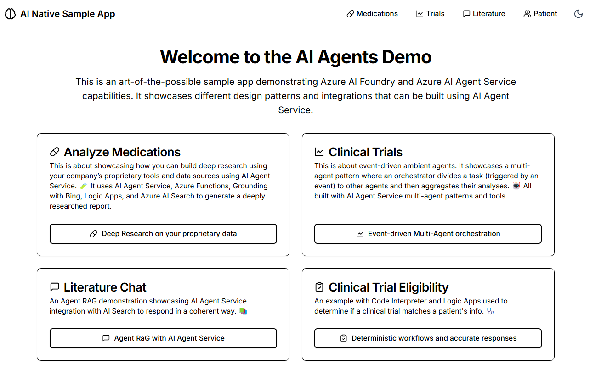
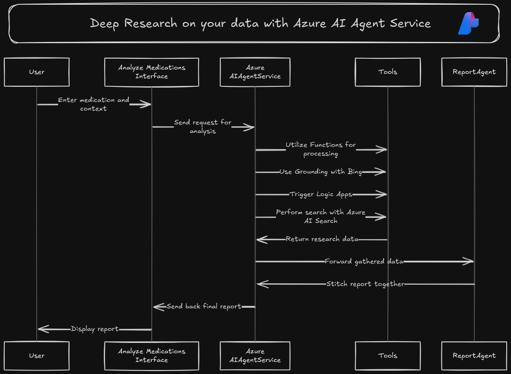
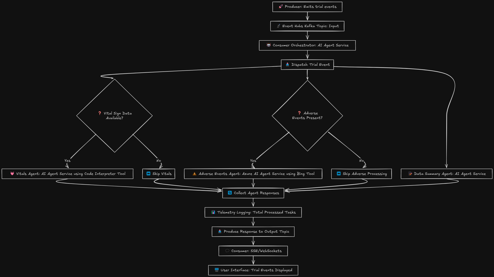
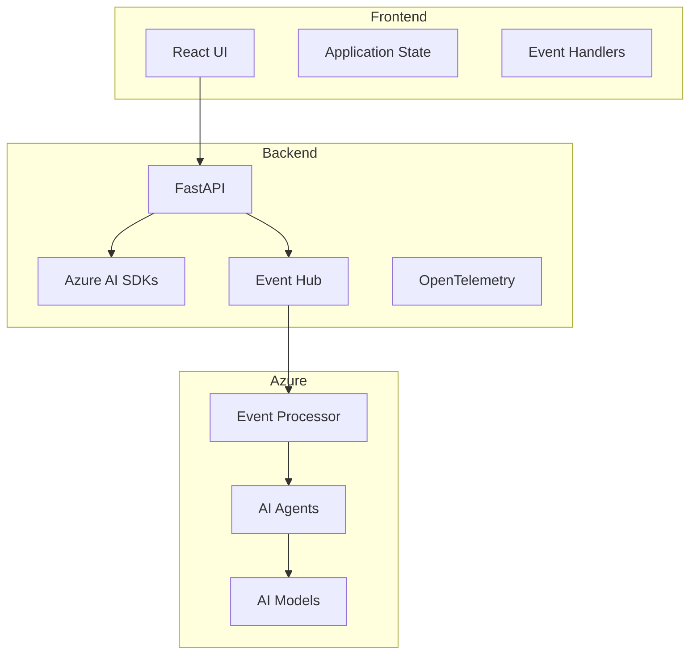

# AI-Native Event-Driven Platform Sample 🧬

## Overview 🎯
This sample demonstrates an AI-native platform built with Azure AI Foundry SDKs. It showcases how to leverage event-driven ambient agents for real-time clinical research, drug discovery, and medical analysis through a full-stack application.
> **Note**: This sample application is for demonstration purposes only and should not be used in production environments. The code and functionality shown here are meant to illustrate concepts and may not include all necessary security, error handling, and optimization features required for a production system.

## Features 🌟

- 💊 **Medication Analysis**: Get comprehensive medication information and AI-powered analysis of drug interactions and effects
- 📊 **Clinical Trials Monitor**: Experience real-time clinical trial monitoring with event-driven AI agents. Simulate trial data streams and observe how agents analyze safety signals and efficacy trends
- 📚 **Literature Answer Engine**: Get instant answers from your research literature. Ask questions about drug research, clinical studies, and scientific publications to receive focused, evidence-based responses
- 👤 **Patient Response Analysis**: AI-powered patient response prediction and monitoring
- 🤖 **Event-Driven Agents**: Real-time analysis and response through Azure Event Hub integration
- 🔍 **Automated Testing**: Evaluation pipelines using Azure AI Evaluation SDK







## Tech Stack 💻

### Backend
- 🐍 Python with FastAPI
- 🤖 Azure AI Foundry SDKs
- 📊 OpenTelemetry for monitoring
- 🔐 Azure Identity for authentication
- 🔄 Azure Event Hub for real-time events

### Frontend
- ⚛️ React with Vite
- 🎨 Tailwind CSS + shadcn/ui
- 📈 Real-time data visualization
- 🌙 Dark/Light theme support

## Quick Start 🚀

### Prerequisites
- Python 3.9+
- Node.js 18+
- uv (Python package manager)
- pnpm (Node.js package manager)
- Azure subscription
- Azure Developer CLI (azd)

### Environment Variables

#### Backend (.env)
```bash
PROJECT_CONNECTION_STRING=<your-connection-string>  # Format: {region}.api.azureml.ms;{subscription_id};{resource_group};{workspace}
MODEL_DEPLOYMENT_NAME=<your-model-deployment>       # Example: gpt-4
EVENTHUB_CONNECTION_STRING=<your-event-hub-connection-string>
EVENTHUB_NAME=event-driven-agents
CONSUMER_GROUP=$Default
```

#### Frontend (.env.local)
```bash
VITE_API_URL=https://localhost:8000
VITE_DEFAULT_THEME=dark
VITE_API_VERSION=v1
VITE_AZURE_ENDPOINT=your_azure_endpoint
```

### Install Package Managers

1. Install uv:
```bash
curl -LsSf https://astral.sh/uv/install.sh | sh
```

2. Install pnpm:
```bash
curl -fsSL https://get.pnpm.io/install.sh | sh -
# or on Windows (PowerShell):
iwr https://get.pnpm.io/install.ps1 -useb | iex
```

### 1. Clone the Repository
```bash
git clone https://github.com/Azure/ai-foundry-workshop
cd 3-ai-native-e2e-sample
```

### 2. Backend Setup
```bash
cd backend
uv venv
source .venv/bin/activate  # Windows: .venv\Scripts\activate
uv pip install -r requirements.txt
```

### 3. Frontend Setup
```bash
cd frontend
pnpm install
```

### 4. Run the Application

Terminal 1 (Backend):
```bash
cd backend
uvicorn main:app --reload
```

Terminal 2 (Frontend):
```bash
cd frontend
pnpm dev
```

Visit:
- Frontend: [http://localhost:3000](http://localhost:3000)
- Backend API docs: [http://localhost:8000/docs](http://localhost:8000/docs)

## Architecture 🏗️



## Key Workflows 🔄

### 1. Medication Analysis
1. Input medication details
2. AI analysis of interactions and effects
3. Comprehensive information retrieval
4. Safety assessment

### 2. Clinical Trial Monitoring
1. Real-time trial data streaming
2. AI agent analysis of safety signals
3. Efficacy trend monitoring
4. Event-driven alerts

### 3. Literature Research
1. Interactive question-answering
2. Scientific literature analysis
3. Evidence-based responses
4. Research insights

## Deployment 🚀

### Deploy with Azure Developer CLI

1. Install Azure Developer CLI:
```bash
curl -fsSL https://aka.ms/install-azd.sh | bash
```

2. Login and deploy:
```bash
azd auth login
azd init
azd up
```

This will deploy:
- Frontend to Azure Static Web Apps
- Backend to Azure Container Apps
- Configure all necessary Azure resources

## Medication Info API

### Analyze Medication
```python
POST /api/molecular-design/analyze-medication

Request:
{
    "medication": "string",  # Required: Name of the medication
    "notes": "string"       # Optional: Additional context
}

Response:
{
    "structured_info": {
        "category": "string",
        "common_side_effects": ["string"],
        "risk_rating": "string",
        "interactions": ["string"]
    },
    "ai_explanation": "string",
    "disclaimer": "string"
}
```

### Frontend Types
```typescript
export interface MedicationInfo {
  name: string;
  notes?: string;
}

export interface MedicationAnalysis {
  structured_info: {
    category: string;
    common_side_effects: string[];
    risk_rating: string;
    interactions: string[];
  };
  ai_explanation: string;
  disclaimer: string;
}
```

### Usage Example
```typescript
// Frontend example
const handleAnalyze = async () => {
  try {
    const data = await api.analyzeMedication({
      name: "Aspirin",
      notes: "Daily low-dose"
    });
    
    // Access structured info
    console.log(data.structured_info.category);
    console.log(data.structured_info.risk_rating);
    
    // Display AI explanation
    console.log(data.ai_explanation);
  } catch (error) {
    console.error("Analysis failed:", error);
  }
};
```

## Learn More 📚

- [Azure AI Foundry Documentation](https://learn.microsoft.com/azure/ai-foundry)
- [Event-Driven Architecture](https://learn.microsoft.com/azure/architecture/guide/architecture-styles/event-driven)
- [Azure Event Hubs Documentation](https://learn.microsoft.com/azure/event-hubs/)
- [FastAPI Documentation](https://fastapi.tiangolo.com/)
- [React Documentation](https://react.dev/)

## License 📄

This project is licensed under the MIT License - see the [LICENSE](./LICENSE) file for details.
