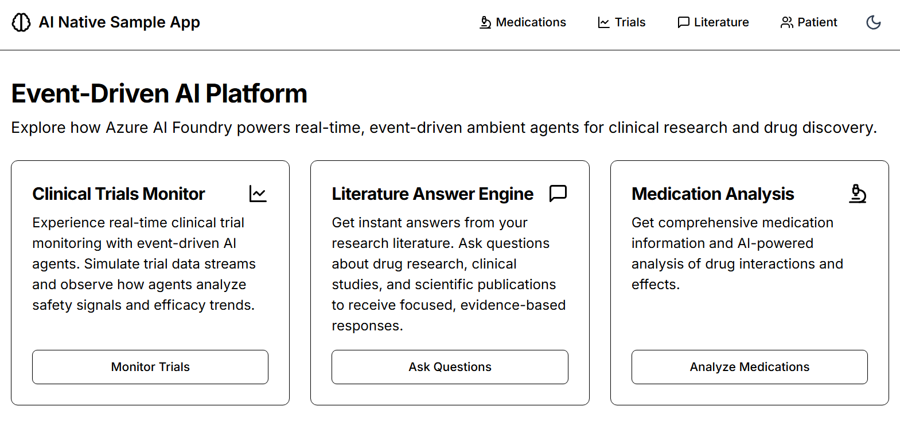
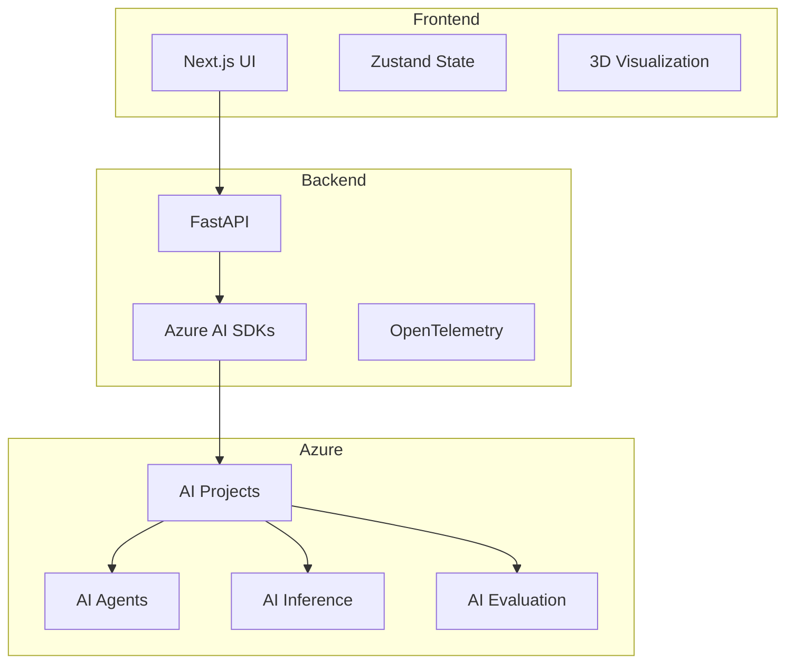

# End-to-End Drug Discovery Platform Sample 🧬

## Overview 🎯
This sample demonstrates a modern drug discovery platform built with Azure AI Foundry SDKs. It showcases how to leverage AI for molecular analysis, literature search, and clinical trial monitoring through a full-stack application.


## Features 🌟

- 💊 **Medication Info Summaries**: Get comprehensive medication information with AI-powered analysis
- 🔬 **Molecular Analysis**: Analyze drug candidates using Azure AI Agents service
- 📚 **Literature Search**: AI-powered scientific literature analysis using Azure AI Search
- 📊 **Clinical Trial Monitoring**: Real-time trial metrics and patient response prediction using Azure AI Agents
- 📈 **Supply Chain Analytics**: Demand prediction and optimization using Azure AI SDKs
- 🔍 **Automated Testing**: Evaluation pipelines using Azure AI Evaluation SDK



## Tech Stack 💻

### Backend
- 🐍 Python with FastAPI
- 🤖 Azure AI Foundry SDKs
- 📊 OpenTelemetry for monitoring
- 🔐 Azure Identity for authentication

### Frontend
- 🚀 Next.js with React

## Quick Start 🚀

### Prerequisites
- Python 3.9+
- Node.js 18+
- uv (Python package manager)
- pnpm (Node.js package manager)
- Azure subscription
- Azure Developer CLI (azd)

### Environment Variables under backend/.env
```bash
PROJECT_CONNECTION_STRING=<your-connection-string>  # Format: {region}.api.azureml.ms;{subscription_id};{resource_group};{workspace}
MODEL_DEPLOYMENT_NAME=<your-model-deployment>       # Example: gpt-4
EMBEDDING_MODEL_DEPLOYMENT_NAME=<your-embedding>    # Example: text-embedding-3-small
EVENT_HUB_CONNECTION_STRING=<your-event-hub-connection-string> # Example: Endpoint=sb://{event-hub-namespace}.servicebus.windows.net/;SharedAccessKeyName={your-key-name};SharedAccessKey={your-key};EntityPath={your-event-hub-name}
EVENT_HUB_NAME=event-driven-agents # Example: event-driven-agents
```

### Install Package Managers

1. Install uv:
```bash
curl -LsSf https://astral.sh/uv/install.sh | sh
```

2. Install pnpm:
```bash
curl -fsSL https://get.pnpm.io/install.sh | sh -
# or on Windows (PowerShell):
iwr https://get.pnpm.io/install.ps1 -useb | iex
```

### 1. Clone the Repository
```bash
git clone https://github.com/Azure/ai-foundry-workshop
cd 3-e2e-drug-discovery-sample
```

### 2. Backend Setup
```bash
cd backend
uv venv
source .venv/bin/activate  # Windows: .venv\Scripts\activate
uv pip install -r requirements.txt

# Configure environment
cp .env.example .env
# Edit .env with your Azure credentials
```

### 3. Frontend Setup
```bash
cd frontend
pnpm install

# Configure environment
cp .env.example .env.local
# Edit .env.local with your settings
```

### 4. Run the Application

Terminal 1 (Backend):
```bash
cd backend
uvicorn main:app --reload
```

Terminal 2 (Frontend):
```bash
cd frontend
pnpm dev
```

Visit:
- Frontend: [http://localhost:3000](http://localhost:3000)
- Backend API docs: [http://localhost:8000/docs](http://localhost:8000/docs)

## Architecture 🏗️



## Key Workflows 🔄

### 1. Molecular Analysis
1. Upload molecule structure
2. AI analysis of properties
3. 3D visualization
4. Safety and efficacy scoring

### 2. Literature Search
1. Enter research query
2. AI agent searches scientific papers
3. Analysis and summarization
4. Interactive results review

### 3. Clinical Trial Monitoring
1. Real-time data collection
2. AI-powered predictions
3. Patient response analysis
4. Safety signal detection

## Deployment 🚀

### Deploy with Azure Developer CLI

1. Install Azure Developer CLI:
```bash
curl -fsSL https://aka.ms/install-azd.sh | bash
```

2. Login and deploy:
```bash
azd auth login
azd init
azd up
```

This will deploy:
- Frontend to Azure Static Web Apps
- Backend to Azure Container Apps
- Configure all necessary Azure resources

## Medication Info API

### Analyze Medication
```python
POST /api/molecular-design/analyze-medication

Request:
{
    "medication": "string",  # Required: Name of the medication
    "notes": "string"       # Optional: Additional context
}

Response:
{
    "structured_info": {
        "category": "string",
        "common_side_effects": ["string"],
        "risk_rating": "string",
        "interactions": ["string"]
    },
    "ai_explanation": "string",
    "disclaimer": "string"
}
```

### Frontend Types
```typescript
export interface MedicationInfo {
  name: string;
  notes?: string;
}

export interface MedicationAnalysis {
  structured_info: {
    category: string;
    common_side_effects: string[];
    risk_rating: string;
    interactions: string[];
  };
  ai_explanation: string;
  disclaimer: string;
}
```

### Usage Example
```typescript
// Frontend example
const handleAnalyze = async () => {
  try {
    const data = await api.analyzeMedication({
      name: "Aspirin",
      notes: "Daily low-dose"
    });
    
    // Access structured info
    console.log(data.structured_info.category);
    console.log(data.structured_info.risk_rating);
    
    // Display AI explanation
    console.log(data.ai_explanation);
  } catch (error) {
    console.error("Analysis failed:", error);
  }
};
```


## Getting Started

### Backend Setup
1. Navigate to the backend directory:
   ```bash
   cd backend
   ```

2. Install dependencies:
   ```bash
   pip install -r requirements.txt
   ```

3. Start the backend server (runs on port 8002):
   
   Windows (PowerShell):
   ```powershell
   .\start.ps1
   ```
   
   Unix/Linux/MacOS:
   ```bash
   ./start.sh
   ```

### Frontend Setup
1. Navigate to the frontend directory:
   ```bash
   cd frontend
   ```

2. Install dependencies:
   ```bash
   npm install
   ```

3. The frontend is configured to connect to the backend at http://localhost:8002 via the .env file.

4. Start the frontend development server:
   ```bash
   npm start
   ```

## Contributing 🤝

1. Fork the repository
2. Create a feature branch
3. Submit a Pull Request

## Learn More 📚

- [Backend Documentation](./backend/README.md)
- [Frontend Documentation](./frontend/README.md)
- [Azure AI Foundry Documentation](https://learn.microsoft.com/azure/ai-foundry)
- [Azure Developer CLI](https://learn.microsoft.com/azure/developer/azure-developer-cli)

## License 📄

This project is licensed under the MIT License - see the [LICENSE](./LICENSE) file for details.
