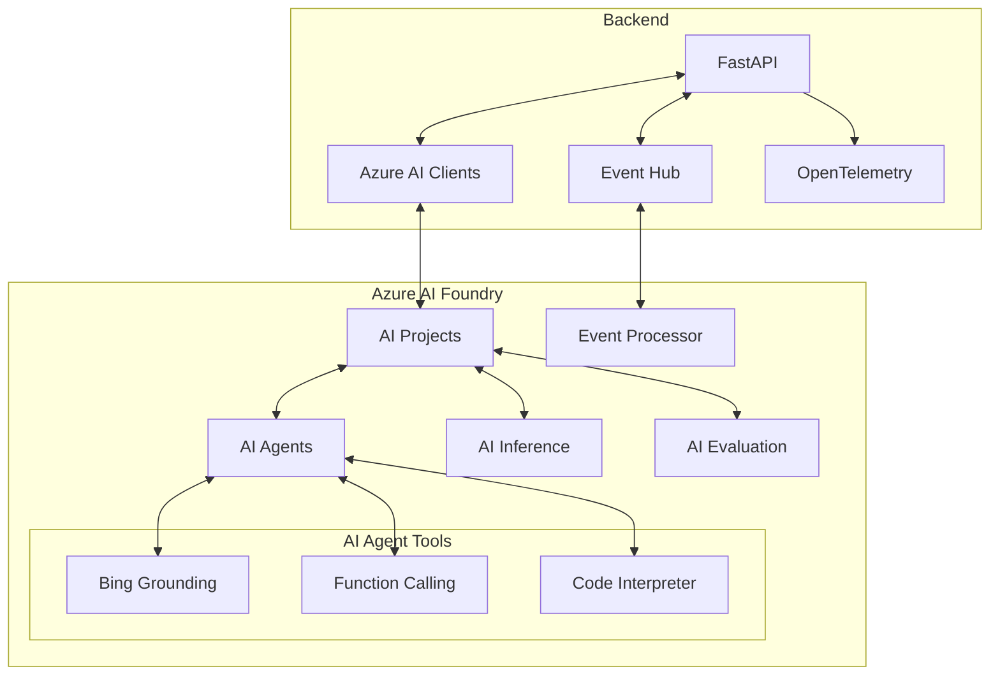

# Drug Development Platform Backend 🧬

## Overview 🎯
Backend for the Drug Development Platform, leveraging Azure AI Foundry SDKs for molecular analysis, clinical trial monitoring, and event-driven AI agents. This backend powers an AI-native platform for real-time clinical research, drug discovery, and medical analysis.

## Features 🌟

- 💊 **Medication Analysis**: Comprehensive medication information and AI-powered analysis
- 📊 **Clinical Trials Monitor**: Real-time monitoring with event-driven AI agents
- 📚 **Literature Answer Engine**: Evidence-based responses from research literature
- 👤 **Patient Response Analysis**: AI-powered predictions and monitoring
- 🤖 **Event-Driven Agents**: Real-time analysis through Azure Event Hub
- 🔍 **Automated Testing**: Evaluation pipelines using Azure AI Evaluation SDK

## Prerequisites 📋

- Python 3.9+
- Azure subscription with access to [Azure AI Foundry](https://ai.azure.com)
- Azure Event Hub instance
- uv (Python package manager)

## Azure AI Integration 🤖

### SDKs Used
- 🎯 **azure-ai-projects**: Project and agent management
  ```python
  # main.py
  project_client = AIProjectClient.from_connection_string(
      credential=credential,
      conn_str=PROJECT_CONNECTION_STRING
  )
  ```

- 🔬 **azure-ai-inference**: Molecular analysis and predictions
  ```python
  # molecular_design.py
  inference_client = project_client.inference.get_chat_completions_client()
  ```

- 📊 **azure-ai-evaluation**: Result analysis and confidence scoring
  ```python
  # automated_testing.py
  evaluation = Evaluation(
      display_name="Drug Analysis Evaluation",
      description="Evaluation of drug analysis outputs",
      data=Dataset(id=data_id),
      evaluators={
          "f1_score": EvaluatorConfiguration(id=F1ScoreEvaluator.id),
          "relevance": EvaluatorConfiguration(id=RelevanceEvaluator.id)
      }
  )
  ```

- 📈 **opentelemetry-sdk**: Performance monitoring and tracing
  ```python
  # main.py
  trace.set_tracer_provider(TracerProvider())
  tracer = trace.get_tracer(__name__)
  ```

- 🔐 **azure-identity**: Secure Azure authentication
  ```python
  # main.py
  credential = DefaultAzureCredential()
  ```

## Getting Started 🚀

1. **Install uv** (if not already installed):
   ```bash
   # Unix/Linux/macOS
   curl -LsSf https://astral.sh/uv/install.sh | sh

   # Windows (PowerShell)
   (Invoke-WebRequest -Uri https://astral.sh/uv/install.ps1 -UseBasicParsing).Content | pwsh
   ```

2. **Create Virtual Environment**:
   ```bash
   uv venv
   source .venv/bin/activate  # Windows: .venv\Scripts\activate
   ```

3. **Install Dependencies**:
   ```bash
   uv pip install -r requirements.txt
   ```

4. **Configure Environment**:
   - Copy `.env.example` to `.env` and fill in the required values

5. **Run the Server**:
   ```bash
   uvicorn main:app --reload --port 8003
   ```

6. **Access API Documentation**:
   - OpenAPI: [http://localhost:8003/docs](http://localhost:8003/docs)
   - ReDoc: [http://localhost:8003/redoc](http://localhost:8003/redoc)

## API Architecture 🏗️



## Key Endpoints 🛠️

### Medication Analysis

#### 1. Analyze Medication
```bash
POST /api/molecular-design/analyze-medication
```
Analyzes medication properties using Azure AI Inference.

Request:
```json
{
    "medication": "Aspirin",
    "notes": "Daily low-dose"
}
```

Response:
```json
{
    "structured_info": {
        "category": "NSAID",
        "common_side_effects": ["stomach irritation", "bleeding risk"],
        "risk_rating": "low",
        "interactions": ["blood thinners", "other NSAIDs"]
    },
    "ai_explanation": "Detailed analysis...",
    "disclaimer": "Medical disclaimer..."
}
```

### Clinical Trials

#### 1. Monitor Trial
```bash
GET /api/clinical-trials/monitor/{trial_id}
```
Real-time monitoring of trial metrics and patient responses.

Response:
```json
{
    "trial_id": "TRIAL-001",
    "phase": "Phase 2",
    "status": "Active",
    "real_time_metrics": {
        "enrollment_rate": 0.75,
        "retention_rate": 0.92,
        "safety_signals": []
    }
}
```

## OpenTelemetry Integration 📊

Distributed tracing monitors the drug development pipeline with key spans:
- `molecular_design.analyze`: Molecule analysis
- `clinical_trials.monitor`: Trial monitoring
- `clinical_trials.predict_response`: Patient predictions

## Deployment with Azure Developer CLI (azd) 🚀

1. **Install Azure Developer CLI**:
   ```bash
   curl -fsSL https://aka.ms/install-azd.sh | bash
   ```

2. **Login and Deploy**:
   ```bash
   azd auth login
   azd init
   azd up
   ```

This deploys:
- Backend to Azure Container Apps
- Configures Event Hub integration
- Sets up monitoring and scaling

## Security 🔒

1. **Environment Variables**:
   - All secrets stored in `.env`
   - Use Azure Key Vault in production

2. **Authentication**:
   - Azure AD integration
   - Role-based access control

3. **Data Protection**:
   - Encryption at rest and in transit
   - Secure communication channels

## Learn More 📚
- [Azure AI Foundry Documentation](https://learn.microsoft.com/azure/ai-foundry)
- [Event-Driven Architecture](https://learn.microsoft.com/azure/architecture/guide/architecture-styles/event-driven)
- [Azure Event Hubs Documentation](https://learn.microsoft.com/azure/event-hubs/)
- [FastAPI Documentation](https://fastapi.tiangolo.com/)

## Contributing 🤝
1. Fork the repository
2. Create a feature branch
3. Submit a Pull Request

## License 📄
This project is licensed under the MIT License - see the [LICENSE](../LICENSE) file for details.
