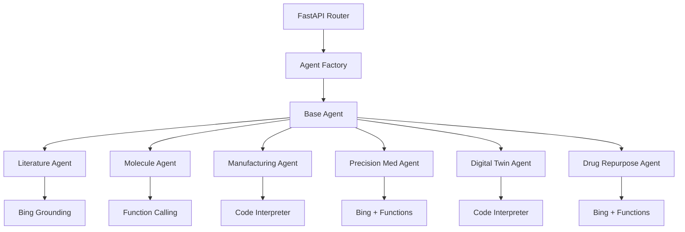

# AI Agents for Drug Discovery
This directory contains specialized AI agents that handle different aspects of
the drug discovery process. Each agent is designed to demonstrate specific
Azure AI capabilities.

## Architecture


## Agent Types

### 1. Literature Search Agent
- **Purpose**: Search and analyze scientific literature
- **Azure AI Features**: Bing grounding for research
- **Endpoint**: `/literature-search`
- **Example Request**:
```json
{
    "query": "Latest research on SGLT2 inhibitors",
    "max_results": 5
}
```

### 2. Molecule Analysis Agent
- **Purpose**: Analyze molecular properties and interactions
- **Azure AI Features**: Function calling for property calculation
- **Endpoint**: `/molecule-analysis`
- **Example Request**:
```json
{
    "smiles": "CC(=O)OC1=CC=CC=C1C(=O)O",
    "target_proteins": ["EGFR", "HER2"],
    "therapeutic_area": "Oncology"
}
```

### 3. Manufacturing Optimization Agent
- **Purpose**: Optimize drug manufacturing processes
- **Azure AI Features**: Code interpreter for optimization
- **Endpoint**: `/manufacturing-opt`
- **Example Request**:
```json
{
    "drug_candidate": "DRUG-001",
    "batch_size_range": [1000, 5000, 10000],
    "raw_materials": {
        "API": 100,
        "Excipient": 500
    }
}
```

### 4. Precision Medicine Agent
- **Purpose**: Personalize treatment recommendations
- **Azure AI Features**: Bing grounding + function calling
- **Endpoint**: `/precision-med`
- **Example Request**:
```json
{
    "patient_id": "PATIENT-001",
    "genetic_markers": {
        "BRCA1": "variant1",
        "BRCA2": "variant2"
    },
    "medical_history": {
        "conditions": ["cancer"]
    }
}
```

### 5. Digital Twin Agent
- **Purpose**: Simulate clinical trial outcomes
- **Azure AI Features**: Code interpreter for simulation
- **Endpoint**: `/digital-twin-sim`
- **Example Request**:
```json
{
    "molecule_parameters": {
        "mw": 342.4,
        "logP": 2.1
    },
    "target_population": {
        "size": 1000,
        "demographics": {
            "age_range": [18, 65]
        }
    }
}
```

### 6. Drug Repurposing Agent
- **Purpose**: Identify new therapeutic applications
- **Azure AI Features**: Bing grounding + function calling
- **Endpoint**: `/drug-repurpose`
- **Example Request**:
```json
{
    "molecule_id": "DRUG-001",
    "current_indication": "Cancer",
    "mechanism_of_action": "Kinase inhibition",
    "target_proteins": ["EGFR", "HER2"]
}
```

## Getting Started

### Prerequisites
- Azure AI Projects SDK
- Azure OpenAI deployment
- Bing API key (for grounding)

### Environment Variables
```bash
PROJECT_CONNECTION_STRING=<your-connection-string>
MODEL_DEPLOYMENT_NAME=<your-model-deployment>
EMBEDDING_MODEL_DEPLOYMENT_NAME=<your-embedding-model>
BING_CONNECTION_NAME=<your-bing-connection>
```

### Usage Example
```python
from agents.factory import AgentFactory
from agents.literature.agent import LiteratureAgent
from agents.types import AgentConfig, ToolResources

# Initialize factory
factory = AgentFactory(project_client, chat_client)

# Create agent config
config = AgentConfig(
    model="gpt-4",
    instructions="Your instructions here",
    tools=[],  # Will be configured by agent
    tool_resources=ToolResources(
        connection_id=os.getenv("BING_API_KEY")
    )
)

# Create agent
agent = LiteratureAgent(project_client, chat_client, config)

# Process request
result = await agent.process({
    "query": "Your search query"
})
```

## Development

### Adding a New Agent
1. Create a new directory under `agents/`
2. Create `__init__.py` and `agent.py`
3. Implement agent class inheriting from `BaseAgent`
4. Add request models and helper functions
5. Update router to use new agent
6. Add tests in `tests/agents/`

### Testing
```bash
# Run all tests
pytest tests/agents/

# Run specific agent tests
pytest tests/agents/test_literature.py
```

## Architecture Details

### Base Agent
The `BaseAgent` class provides common functionality:
- Agent initialization
- Conversation management
- Error handling
- Telemetry

### Agent Factory
The `AgentFactory` handles:
- Agent creation
- Configuration management
- Caching for performance
- Resource cleanup

### Tool Configuration
Each agent configures its tools using `create_tool_config()`:
- Bing grounding for research
- Function calling for analysis
- Code interpreter for simulation

## Contributing
1. Create feature branch
2. Add tests
3. Update documentation
4. Create pull request

## License
This project is licensed under the MIT License.
