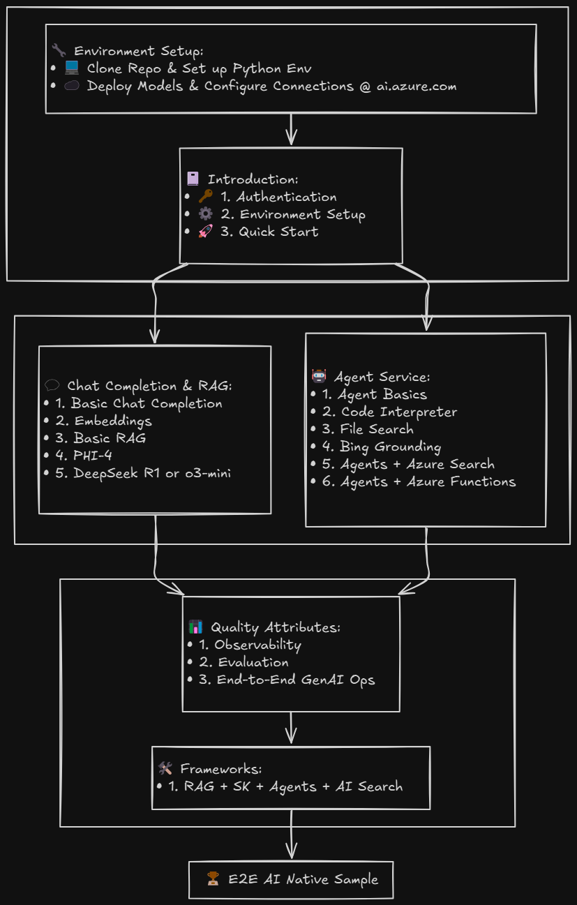

# Azure AI Foundry Workshop

<div align="center">

[📦Prerequisites](#-prerequisites) | [🚀Quick Start](#-quick-start) | [🤖Overview](#-overview) | [📔Workshop Content](#-workshop-content) | [🧩Project Structure](#-project-structure) | [❓Support](#-support) | [🤝Contributing](#-contributing)

</div>


## 🤖 Overview

건강 및 식단 조언과 관련된 재미있는 예제를 통해 Azure AI Foundry를 기반으로 지능형 앱 및 AI 에이전트를 빌드하는 방법을 안내하는 실습 워크샵입니다. 다음의 내용을 포함합니다.
- Azure AI Foundry 기본 사항 알아보기
- 인증 및 프로젝트 구성 설정
- AI 모델 배포 및 테스트
- AI 에이전트 빌드(건강 어드바이저 예제)
- 건강 계산 및 식단 계획 구현
- 에이전트 성능 평가 및 품질 속성 모니터링
- 모든 기능과 디자인 패턴이 통합된 엔드투엔드 AI 네이티브 샘플 앱 배포

> **소요 예상 시간**: 4-5 시간  
> **Focus**: 실습, 대화형 노트북, 실용적인 예제, 엔드투엔드 프로젝트

## 🎥 Workshop Overview Video

워크숍에 대한 포괄적인 이해를 돕기 위해 개요 동영상을 시청하세요:

[](https://youtu.be/0bGLgmZJ6DE)

## 📸 Visuals

### Sections Overview

*Figure 1: Overview of different sections in this workshop.*

### End-to-End Sample UI

*Figure 2: User interface of the end-to-end AI native sample project.*

---

## 📦 사전 준비 사항    

워크샵을 시작하기 전에 다음이 설치되어 있는지 확인하세요:

- [Python 3.10](https://www.python.org/downloads/) 이상 설치
- [Azure AI Foundry](https://ai.azure.com 에 대한 액세스 권한이 있는 활성 Azure 구독
- [Azure CLI](https://learn.microsoft.com/en-us/cli/azure/install-azure-cli) 설치
- [Git](https://git-scm.com/downloads) 설치
- [VS Code](https://code.visualstudio.com/), [GitHub Codespaces](https://github.com/features/codespaces), 또는 [Jupyter Notebook](https://jupyter.org/install) 환경
- 기본 Python 프로그래밍 지식
- Azure AI Foundry에서 모델 배포 및 [AI Search](https://learn.microsoft.com/en-us/azure/search/search-what-is-azure-search) 연결 구성

---

## 🚀 빠른 시작

1. **리포지토리 복제**:
   ```bash
   git clone https://github.com/Azure/ai-foundry-workshop.git
   cd ai-foundry-workshop
   ```

2. **uv 설치**:
   ```bash
   # Unix/Linux/macOS
   curl -LsSf https://astral.sh/uv/install.sh | sh

   # Windows (PowerShell)
   (Invoke-WebRequest -Uri https://astral.sh/uv/install.ps1 -UseBasicParsing).Content | pwsh
   ```

3. **가상 환경 생성 및 활성화**:
   ```bash
   uv venv
   source .venv/bin/activate  # Windows: .venv\Scripts\activate
   ```

4. **Azure AI Foundry 설정**:

   a. **프로젝트 생성 및 리소스 배포**:
      1. [Azure AI Foundry](https://ai.azure.com)로 이동
      2. AI 파운드리 마법사를 사용하여 새 AI 허브 및 프로젝트 만들기
      3. 필요한 모델 배포:
         - GPT models(gpt-4o, gpt-4o-mini) for chat/completion (**set TPM to max** to avoid issues with Agents notebooks)
         - Embedding model for vector search
         - Ensure the model is deployed in `Global-Standard` or `DataZone-Standard`
      4. Set up connections:
         - Configure [Grounding with Bing](https://learn.microsoft.com/en-us/azure/ai-services/agents/how-to/tools/bing-grounding?view=azure-python-preview&tabs=python&pivots=overview) connection
         - Configure Azure AI Search connection
      5. Add your user account to the `Azure AI Developer` role from Azure AI Foundry Management Portal

   b. **Configure Environment Variables**:
      ```bash
      cp .env.example .env
      ```
      Update `.env` with your Azure AI Foundry values:
      - `PROJECT_CONNECTION_STRING`: Your project connection string from Azure ML workspace
      - `MODEL_DEPLOYMENT_NAME`: Your model deployment name
      - `EMBEDDING_MODEL_DEPLOYMENT_NAME`: Your embedding model deployment name
      - `TENANT_ID`: Your tenant ID from Azure portal
      - `BING_CONNECTION_NAME`: Your Bing search connection name
      - `SERVERLESS_MODEL_NAME`: Your serverless model name

      > **Note**: The model specified in `MODEL_DEPLOYMENT_NAME` must be supported by Azure AI Agents Service or Assistants API. See [supported models](https://learn.microsoft.com/en-us/azure/ai-services/agents/concepts/model-region-support?tabs=python#azure-openai-models) for details. For Grounding with Bing Search, you need to use `gpt-4o-mini` model.

5. **Install dependencies**:
   ```bash
   # Install core Azure AI SDKs and Jupyter requirements
   uv pip install azure-identity azure-ai-projects azure-ai-inference[opentelemetry] azure-search-documents azure-ai-evaluation azure-monitor-opentelemetry

   # Install Jupyter requirements
   uv pip install ipykernel jupyterlab notebook

   # Register the kernel with Jupyter
   python -m ipykernel install --user --name=.venv --display-name="Python (.venv)"

   # Install additional requirements (optional - for deploying repo or running mkdocs)
   uv pip install -r requirements.txt
   ```

   > **Note**: If you encounter kernel errors in VS Code, try:
   > 1. Select kernel: Click "Select Kernel" > "Python Environments" > "Python (.venv)"
   > 2. If kernel is not listed, run `python -m ipykernel install --user --name=.venv` again, or use the "Create New Kernel" wizard in VS Code to create a new Python environment
   > 3. Reload VS Code if needed

6. **Choose your notebook environment**:

   **Option A: VS Code**
   - Install [VS Code Python extension](https://marketplace.visualstudio.com/items?itemName=ms-python.python)
   - Install either:
     - [Jupyter extension](https://marketplace.visualstudio.com/items?itemName=ms-toolsai.jupyter) for .ipynb files
     - [Polyglot Notebooks extension](https://marketplace.visualstudio.com/items?itemName=ms-dotnettools.dotnet-interactive-vscode) for .dib files
   - Open any notebook and select your Python kernel (.venv)

   **Option B: GitHub Codespaces**
   - Click "Code" > "Create codespace" on the repository
   - Wait for environment setup
   - Notebooks will be ready to run

   **Option C: Jupyter Lab/Notebook**
   ```bash
   # Install Jupyter if you haven't already
   uv pip install jupyterlab notebook

   # Start Jupyter Lab (recommended)
   jupyter lab

   # Or start Jupyter Notebook
   jupyter notebook
   ```

7. **Follow the Learning Path**:
    1. **Introduction** (`1-introduction/`)
       - `1-authentication.ipynb`: Set up your Azure credentials
       - `2-environment_setup.ipynb`: Configure your environment
       - `3-quick_start.ipynb`: Learn basic operations

    2. **Main Workshop** (`2-notebooks/`)
       - Chat Completion & RAG (`1-chat_completion/`)
       - Agent Development (`2-agent_service/`)
       - Quality Attributes (`3-quality_attributes/`)

---

## 📔 Workshop Learning Path

Follow these notebooks in sequence to complete the workshop:

### 1. Introduction (`1-introduction/`)
| Notebook | Description |
|----------|-------------|
| [1. Authentication](1-introduction/1-authentication.ipynb) | Set up Azure credentials and access |
| [2. Environment Setup](1-introduction/2-environment_setup.ipynb) | Configure your development environment |
| [3. Quick Start](1-introduction/3-quick_start.ipynb) | Learn basic Azure AI Foundry operations |

### 2. Main Workshop (`2-notebooks/`)
| Topic | Notebooks |
|-------|-----------|
| **Chat Completion & RAG** | • [Chat Completion & RaG](2-notebooks/1-chat_completion/) |
| **Agent Development** | • [Agent Development](2-notebooks/2-agent_service/) |
| **Quality Attributes** | • [Observability & Evaluations](2-notebooks/3-quality_attributes/) |

---

## 🤝 Contributing

We welcome contributions! Please see our [Contributing Guide](CONTRIBUTING.md) for details on how to:
- Submit bug reports and feature requests
- Submit pull requests
- Follow our coding standards
- Participate in code reviews

---

## ❓ Support

If you need help or have questions:

---


