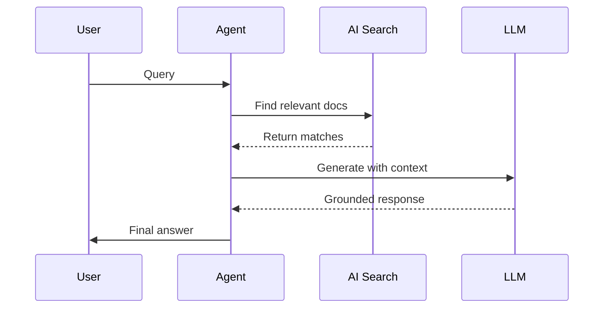

# Agent Design Patterns in Azure AI Foundry 🎯

## Common Patterns

### 1. RAG Pattern
Retrieval-Augmented Generation enhances responses with relevant data:



### 2. Multi-Tool Pattern
Combining multiple tools for complex tasks:

```python
from azure.ai.projects.models import (
    FileSearchTool,
    CodeInterpreterTool,
    BingGroundingTool
)

# Create multi-tool agent
agent = project_client.agents.create(
    name="health-advisor",
    tools=[
        FileSearchTool(name="health-docs"),
        CodeInterpreterTool(name="health-calc"),
        BingGroundingTool(name="research")
    ]
)
```

### 3. Event-Driven Pattern
Processing real-time events with agents:

```python
from azure.eventhub import EventHubConsumerClient

# Process events with agent
async def process_events(agent, partition_context, event):
    data = event.body_as_json()
    response = await agent.process_event(data)
    await handle_response(response)

client = EventHubConsumerClient.from_connection_string(
    conn_str=EVENTHUB_CONNECTION_STRING,
    consumer_group="$Default"
)
```

For implementation examples, see:
- [RAG Implementation](../2-notebooks/2-agent_service/5-agents-aisearch.ipynb)
- [Multi-Tool Example](../2-notebooks/2-agent_service/2-code_interpreter.ipynb)
- [Event Processing](../3-ai-native-e2e-sample/backend/README.md)
