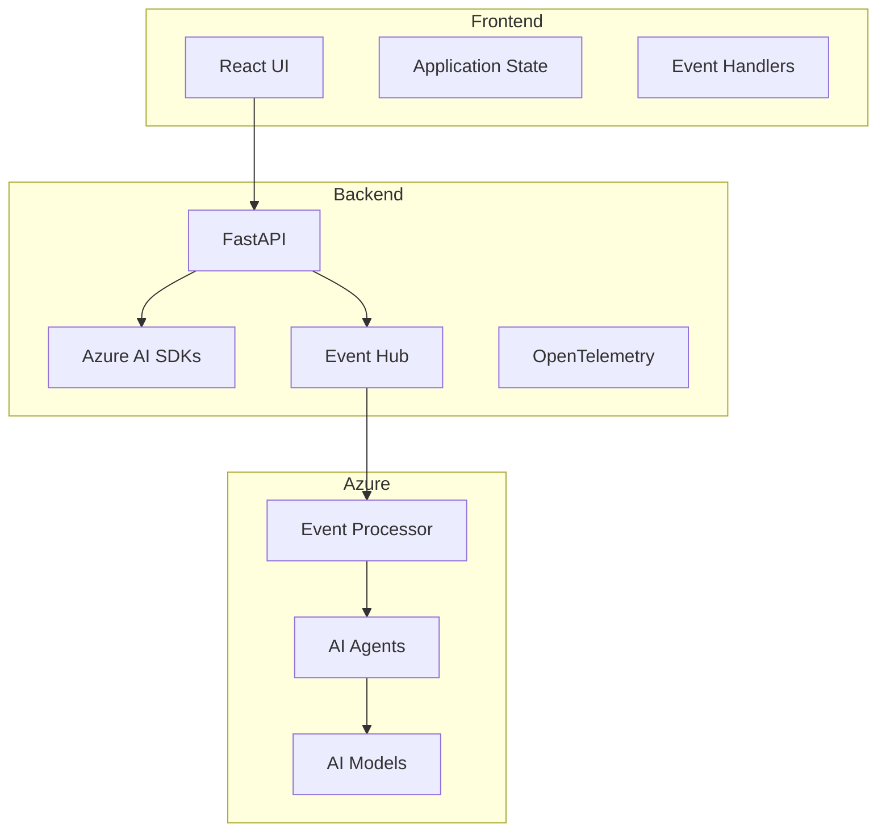

# E2E Sample Architecture 🏗️

## Overview
The end-to-end sample demonstrates a complete AI-native application using Azure AI Foundry services.

## Components

### Backend Services
- FastAPI application
- [Azure AI Foundry](https://learn.microsoft.com/azure/ai-foundry) SDKs integration 【†L1】
- [Azure Functions](https://learn.microsoft.com/azure/azure-functions) for serverless compute 【†L9】
- OpenTelemetry instrumentation
- Event-driven architecture with [Logic Apps](https://learn.microsoft.com/azure/logic-apps) 【†L8】

### Frontend Application
- React with Vite
- Real-time updates
- Interactive visualizations
- Dark/light theme support

## Architecture Diagram



## Implementation Details

### Agent Configuration
```python
from azure.ai.projects import AIProjectClient
from azure.ai.projects.models import Agent

# Create specialized agents
literature_agent = project_client.agents.create(
    name="literature-search",
    tools=[FileSearchTool(name="pubmed-search")]
)

trial_agent = project_client.agents.create(
    name="trial-monitor",
    tools=[
        CodeInterpreterTool(name="data-analyzer"),
        FileSearchTool(name="trial-docs")
    ]
)
```

### Event Processing
```python
from azure.eventhub import EventHubConsumerClient

# Process trial events
client = EventHubConsumerClient.from_connection_string(
    conn_str=EVENTHUB_CONNECTION_STRING,
    consumer_group="$Default"
)
```

For complete implementation details, see the [e2e sample README](../3-ai-native-e2e-sample/README.md).
