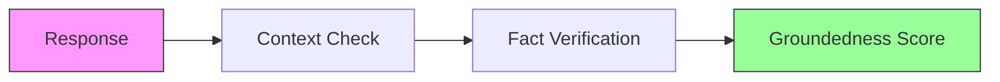
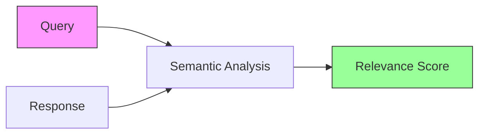
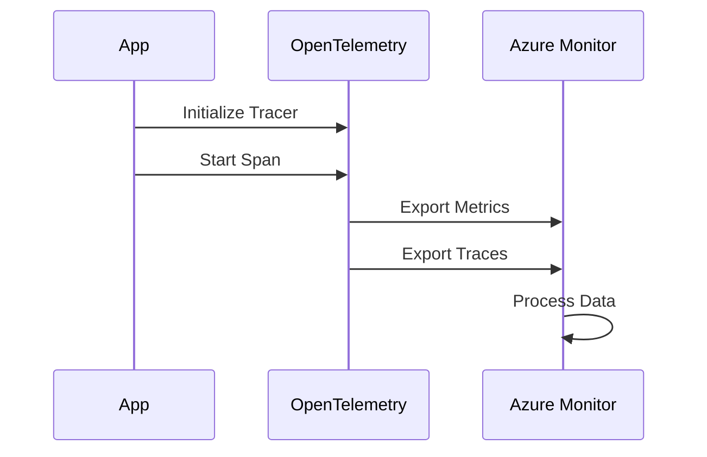
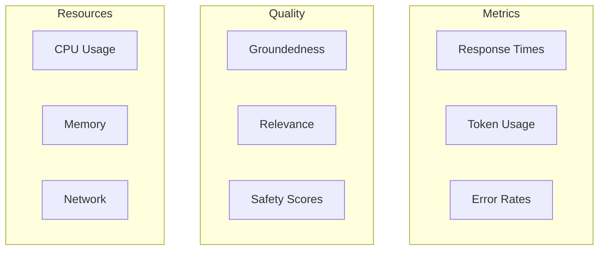

# Evaluation Metrics in Azure AI Foundry 📊

## Overview
Azure AI Foundry provides comprehensive evaluation capabilities through the Azure AI Evaluation SDK. This guide covers key metrics and monitoring patterns.

## Evaluation Metrics

### 1. Groundedness
Measures how well responses are grounded in provided context:



```python
from azure.ai.evaluation import GroundednessEvaluator

evaluator = GroundednessEvaluator()
score = evaluator.evaluate(
    response="The recommended daily protein intake is 0.8g per kg.",
    context="According to health guidelines, adults should consume 0.8g of protein per kg of body weight daily."
)
print(f"Groundedness Score: {score.value}")
```

### 2. Relevance
Assesses response relevance to the query:



```python
from azure.ai.evaluation import RelevanceEvaluator

evaluator = RelevanceEvaluator()
score = evaluator.evaluate(
    query="What exercises are good for beginners?",
    response="Start with walking, bodyweight squats, and gentle stretching.",
    context="Beginner-friendly exercises include walking, basic bodyweight movements, and stretching routines."
)
print(f"Relevance Score: {score.value}")
```

## Observability Implementation

### OpenTelemetry Integration



1. Configure OpenTelemetry:
```python
from opentelemetry import trace
from opentelemetry.sdk.trace import TracerProvider
from azure.monitor.opentelemetry import configure_azure_monitor

# Initialize tracer
tracer_provider = TracerProvider()
trace.set_tracer_provider(tracer_provider)

# Configure Azure Monitor
configure_azure_monitor(
    connection_string=os.getenv("APPLICATIONINSIGHTS_CONNECTION_STRING")
)

# Create tracer
tracer = trace.get_tracer(__name__)
```

2. Implement tracing:
```python
@tracer.start_as_current_span("process_health_query")
def process_health_query(query: str):
    try:
        # Add attributes to span
        span = trace.get_current_span()
        span.set_attribute("query.length", len(query))
        
        # Process query
        response = health_advisor.process(query)
        
        # Record success
        span.set_status(Status(StatusCode.OK))
        return response
    except Exception as e:
        # Record error
        span.set_status(Status(StatusCode.ERROR))
        span.record_exception(e)
        raise
```

### Azure Monitor Integration

1. Configure metrics:
```python
from azure.monitor.opentelemetry import metrics
from opentelemetry.metrics import Meter

# Create meter
meter = metrics.get_meter(__name__)

# Create metrics
response_time = meter.create_histogram(
    name="response_time",
    description="Time taken to process queries",
    unit="ms"
)
```

2. Record metrics:
```python
def process_query(query: str):
    with response_time.record_duration():
        result = health_advisor.process(query)
    return result
```

## Performance Tracking

### Key Metrics to Monitor
- Response latency
- Token usage
- Error rates
- Groundedness scores
- Relevance scores
- Resource utilization

### Dashboard Example


For implementation examples, see:
- [Evaluation Notebook](../2-notebooks/3-quality_attributes/2-evaluation.ipynb)
- [Observability Notebook](../2-notebooks/3-quality_attributes/1-Observability.ipynb)
