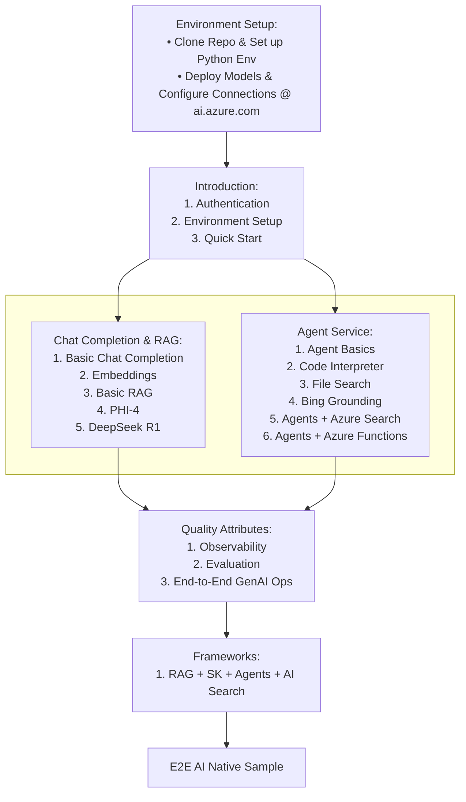

# Building a Health & Fitness AI Advisor with Azure AI Foundry 🏃‍♂️

Welcome to this hands-on, 2-hour workshop where you'll build a practical health and fitness AI advisor using Azure AI Foundry! You'll learn how to deploy an AI model, create an intelligent agent, and evaluate its performance - all through an engaging health-focused use case. 💪

> [!NOTE]
> This documentation is a work in progress. Some sections may be incomplete or subject to change as we continue to improve and expand the workshop content.

## The Use Case: Smart Health Advisory

You'll build an AI agent that can:
- Provide personalized fitness guidance
- Handle nutrition and exercise inquiries
- Access health and wellness resources
- Learn from user interactions
- Provide safe, accurate health advice with disclaimers

## Workshop Timeline (2 hours)

1. **Setup and Model Deployment (30 min)**
   - Quick platform overview
   - Deploy Azure OpenAI model
   - Basic configuration and testing

2. **Agent Development (45 min)**
   - Create health advisor agent
   - Implement health guidance system
   - Add health knowledge base

3. **Evaluation and Monitoring (45 min)**
   - Set up key metrics
   - Monitor performance
   - Analyze and improve responses

## Prerequisites

- Azure subscription with AI services access
- Python 3.8 or later
- Basic Python knowledge
- Text editor or IDE

## What You'll Learn

Through this practical example, you'll understand:
- How to use the AI Foundry SDK
- Model deployment and configuration
- Agent creation and management
- Performance evaluation and monitoring
- Best practices for AI applications

Let's start by [setting up your environment](introduction/overview.md)!
