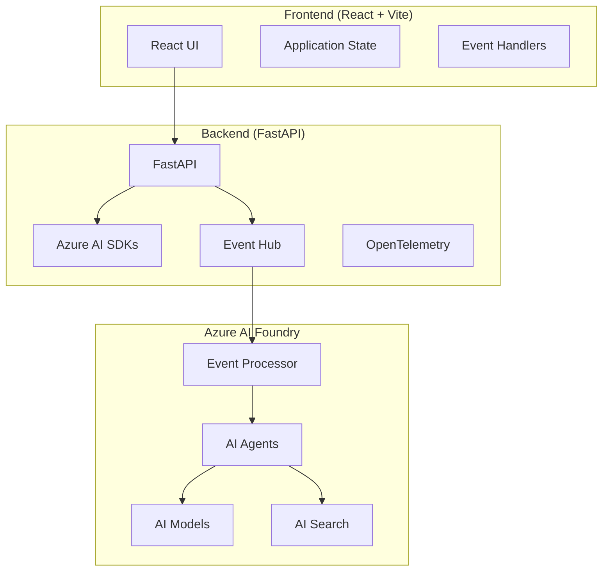

# E2E Sample Architecture 🏗️

## Overview
The end-to-end sample demonstrates a complete AI-native application using Azure AI Foundry services.

## Architecture Diagram

## Components

### Backend Services
- FastAPI application
- [Azure AI Foundry](https://learn.microsoft.com/azure/ai-foundry) SDKs integration 【†L1】
- [Azure Functions](https://learn.microsoft.com/azure/azure-functions) for serverless compute 【†L4】
- OpenTelemetry instrumentation
- Event-driven architecture with [Logic Apps](https://learn.microsoft.com/azure/logic-apps) 【†L5】

### Frontend Application
- React with Vite
- Real-time updates
- Interactive visualizations
- Dark/light theme support

For implementation details, see:
- [Backend Implementation](../3-ai-native-e2e-sample/backend/README.md)
- [Frontend Implementation](../3-ai-native-e2e-sample/frontend/README.md)
